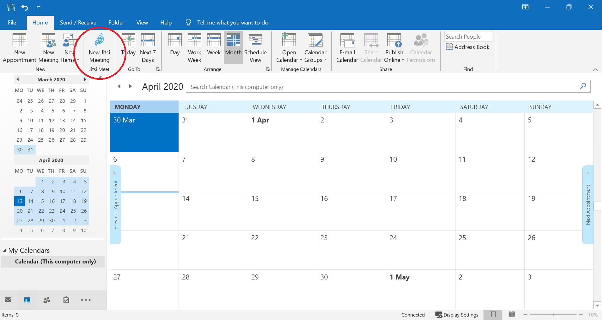
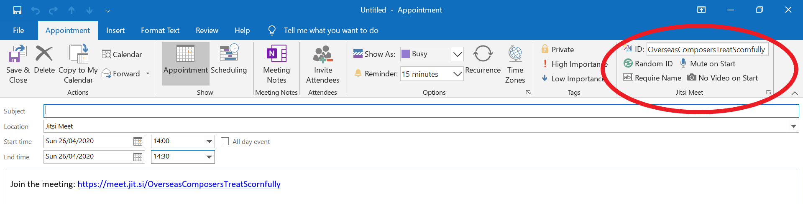
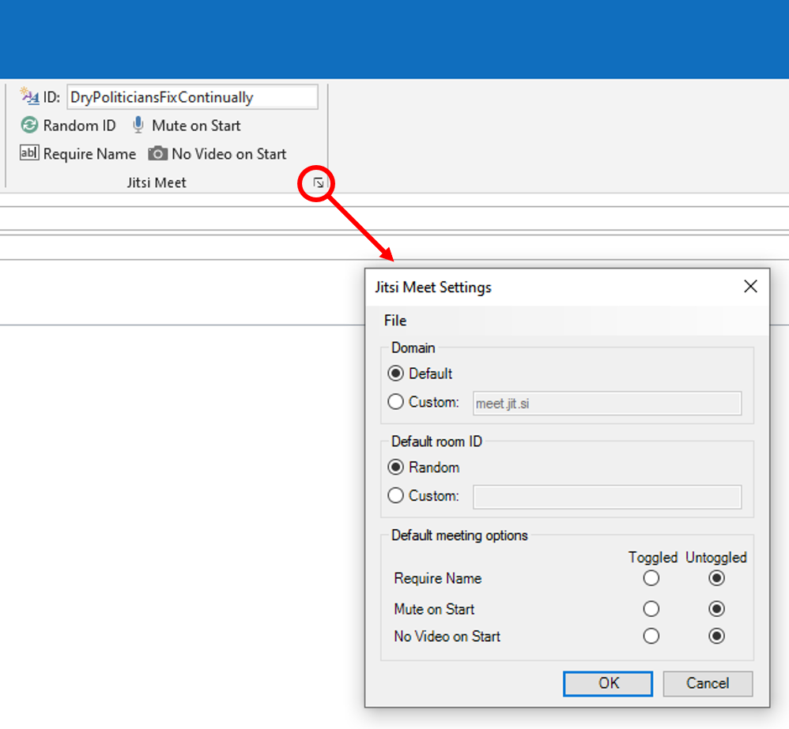
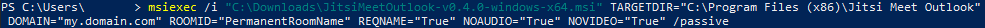

# Jitsi Meet Outlook Add-In

## Introduction

This is a small plug-in that aims to integrate Jitsi Meet with Microsoft Outlook. Specifically, it adds two main features:

1. A button in the Outlook calendar tab that opens a new appointment and inserts a randomly generated Jitsi Meet URL.
2. A set of controls in the Outlook appointment window that, for example, allows for specification of a Room ID of choice and whether participants will be muted upon entry to the room.

It was created to fulfil [this](https://community.jitsi.org/t/plug-ins-for-adding-jitsi-meet-links-to-appointment-requests-emails/21564) request, and more generally with a view to facilitate organisational use of Jitsi Meet. This project is not affiliated with that of Jitsi Meet nor its creators.

The screenshots below display the features of implemented in this add-in.

## Screenshots

### Calendar view

<br/>

### Appointment view



### Settings



### CMD Install



## Installation

### New

Go to the [releases](/../../releases) page and download the MSI installer for the latest version.

For versions prior to 0.5.0: Make sure to download and run the JitsiMeetOutlook-v<version>-windows-<architecture>.msi file that matches the architecture of your installation of Microsoft Office. I.e. if Office was installed as 64-bit, then run JitsiMeetOutlook-v0.4.0-windows-x64.msi.

### Upgrade

Please uninstall any previously installed version of this add-in via the "Add or remove programs" pane in Windows before upgrading.

### Uninstall

The add-in can be uninstalled via the "Add or remove programs" pane in Windows, or by running the MSI installer again.

### Command Line

As of v0.4.0, the add-in can be installed via command line with custom setting passed as parameters. This works by calling `msiexec` on the .msi installer file. The following parameters can be passed to the installer to preconfigure the Jitsi Meet Outlook add-in settings (all are optional):

- `TARGETDIR`: Path to the install directory.
- `DOMAIN`: Custom domain.
- `ROOMID`: A default room ID new Jitsi Meet appointments get assigned.
- `MODE`: The mode of the random room ID generator, e.g. phrases or strings. (phrase/string)
- `REQNAME`: Require name by default in new Jitsi Meet appointments. (True/False)
- `NOAUDIO`: Mute audio by default in new Jitsi Meet appointments. (True/False)
- `NOVIDEO`: Disable video by default in new Jitsi Meet appointments. (True/False)
- `LANG`: Specify the display language. Currently, English, French, German, and Russian are available. (en/fr/de/ru)
- `CONFERENCEMAPPER_ENDPOINT`: Endpoint to get the Conference PIN from. Set to "none" if dial-in is not supported.
- `PHONENUMBERLIST_ENDPOINT`: Endpoint to get the Phone Number from to call in. Set to "none" if dial-in is not supported.
- `CONFERENCESCHEDULER_ENDPOINT`: Endpoint to send the conference information to in advance, in order to make the call available for call in before the first person joins
- `CONFERENCESCHEDULER_ENDPOINT_SECRET`: Secret for the `CONFERENCESCHEDULER_ENDPOINT`, used for JWT generation.

Example install command: `msiexec /i "C:\Downloads\JitsiMeetOutlook-v0.6.0-windows-anycpu.msi" TARGETDIR="C:\Program Files (x86)\Jitsi Meet Outlook" DOMAIN="my.domain.com" ROOMID="PermanentRoomName" MODE="string" REQNAME="True" NOAUDIO="True" NOVIDEO="True" LANG="en" CONFERENCEMAPPER_ENDPOINT="https://my.domain.com/conferenceMapper" PHONENUMBERLIST_ENDPOINT="https://my.domain.com/phoneNumberList" /passive`

All settings can be changed from the settings menu after installation.

### Proxy

Set them via `PROXY_INFORMATION` variable, e.g.:

```
 <system.net>
    <defaultProxy enabled="true" useDefaultCredentials="true">
      <proxy
        usesystemdefault="true"
        proxyaddress="http://192.168.1.10:3128"
        bypassonlocal="true"
      />
       <proxy autoDetect="true" scriptLocation="http:/wpad.dat"/>
    </defaultProxy>
  </system.net>
```

## Roadmap

The published code and installer is still at an early stage. Preliminarily, the following amendments are in the pipeline:

- [ ] Add RTF body text to appointment for improved appearance
- [ ] Shift the controls in the appointment ribbon to the left
- [ ] Create appointment with time as specified in the calendar view
- [ ] Add checks for Outlook having been installed on the target computer
- [ ] Add persistent setting: add URL to Location field of appointment
- [x] Add setting allowing users to generate random strings instead of random combinations of words (0.6.0)
- [x] Add possibility for preconfiguration of settings via silent installs (v0.4.0)
- [x] Make the installation procedure less painful (v0.2.0)
- [x] Add small icons to the buttons in the appointment ribbon (v0.2.0)
- [x] Add a button for starting a conference with video muted to appointment tab (v0.2.0)
- [x] Only show Jitsi buttons if appointment was created through "New Jitsi Meeting" (v0.2.0)
- [x] Add persistent setting: change Jitsi domain (v0.2.0)
- [x] Add persistent setting: preference for whether to start a call with muted mic or video (v0.3.0)
- [x] Add persistent setting: assign a default or random room ID on creation of new appointment (v0.3.0)
- [x] Add checks on the validity of the custom domain value provided (v0.2.1)
- [x] Widen the custom Room ID field (v0.2.1)

Since this plug-in is brand new, any feedback would be most appreciated!

## Changelog

### v0.7.0

Breaking:

Changed the .dll and Registry Entries to not contain spaces anymore. ("Jitsi Meet Outlook Add-In" => "JitsiMeetOutlookAddIn")

Enhancements:

- Add Phone Numbers (from the Jitsi Installation pointed to)
- Use Conference PIN (from the Jitsi Installation pointed to, instead of manually generated)
- Add Conference Scheduler to plan meetings ahead of time on the jitsi server side
- Add Button to add Jitsi Conference in normal meetings
- Refactoring to enable modification of already saved/closed meetings

### v0.6.6

Enhancements:

- Add Czech language support (thanks to [eltovegasag](/../../../../eltovegasag))
- Add Spanish language support (thanks to [nessor](/../../../../nessor))
- Patch French language support (thanks to [reseauconcept](/../../../../reseauconcept))

### v0.6.5

Bugfixes:

- Upgrade dependencies to patch [security vulnerability](https://github.com/dotnet/runtime/issues/49377) in System.Text.Encodings.Web 4.7.1

### v0.6.4

Enhancements:

- #40: Set new appointments to Meeting mode by default
- #19: Assign time-slot selection in calendar view to new appointment (thanks to [Extazx2](/../../../../Extazx2))

### v0.6.3

Bugfixes:

- Reset ribbon buttons if the link is re-created in an empty appointment.
  Enhancements:
- Improved French translation (thanks to [guizmo05](/../../../../guizmo05))

### v0.6.2

Bugfixes:

- #26: Plugin no longer breaks when users try to generate a random ID in an appointment where the URL has been partially or completely deleted. A new message and URL is instead added to the appointment.

### v0.6.1

Enhancements:

- Added German as a language option (thanks to [AdaptiveThinking](/../../../../AdaptiveThinking) for providing the translation)

### v0.6.0

Bugfixes:

- #11: Room ID names typed by users are now filtered such that only legal characters (latin alphanumeric) enter the URL
- #18: The installer check for VSTO runtime is now less stringent

Enhancements:

- #6: Random string generation as a new option
- #20: Translation of random phrases (thanks to [gillesdubois](https://github.com/gillesdubois) for the French translation)
- #17: Minor update to Russian translation

### v0.5.1

Enhancements:

- Added Russian as a language option (thanks to [semencha](/../../../../semencha) for providing the translation)
- Updated link to the latest VSTO runtime in warning pop-up from install check

### v0.5.0

Enhancements:

- Added support for changing display language
- Added French as a language option (thanks to [gillesdubois](/../../../../gillesdubois) for providing the translation)
- Installer has been migrated from Microsoft Setup Project to WiX 3.14 for improved reliability
  Other issues:
- From this version onwards, the add-in will only be compiled for "AnyCPU", which means that the same installer will work with both x86 and x64 bit versions of Outlook. See more information at [Microsoft's pages](https://docs.microsoft.com/en-us/visualstudio/vsto/building-office-solutions?view=vs-2019#change-the-platform-target).

### v0.4.0

Enhancements:

- Added possibility of passing custom settings as parameters to the installer via the command line

### v0.3.0

Enhancements:

- New setting for whether to start a call with muted mic or video
- New setting for whether new appointments should be assigned a random or a default room ID
- The custom domain setting now accepts port specification in the domain name (e.g. my.domain.com:8080)

### v0.2.1

- Bug fixes related to specification of a custom domain
- Custom domain names provided by user now has to pass a validity check
- Improved layout in the appointment view (widened Room ID field and reorganisation of buttons)

### v0.2.0

- The installer no longer prompts trust certificate issues and delegates trust decision to user
- Small icons have been added to the buttons in the appointment ribbon
- A button for starting with the video turned off has been added to the appointment ribbon
- The appointment ribbon buttons are only displayed for appointments created via the "New Jitsi Meeting" button in the calendar tab
- Persistent settings have been enabled
- It is now possible to specify a custom domain in the settings dialogue
- Various small bugs have been fixed to improve reliability

### v0.1.0

- Initial release of the project
